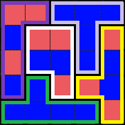
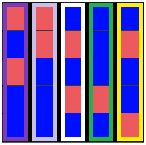

# Redistricting a Geographic Region

The objective of this project is to support the development of computer programs that help demonstrate the implications of splitting a given geographic region into election districts (redistricting).

The intended product is a maintainable Java utility package that addresses fundamental components needed for redistricting activities, analyses, and visualizations.

Early versions of the product may utilize some or all of the following simplifications (preconditions):

* The region is represented by a rectangular grid.
* The number of voters at each location is exactly 1.
* There is a predetermined number of parties.

The following explains the main concepts and terms used in this project.

## Region
In its simplest form, a region is specified as a two-dimensional grid of locations (using row and column indices).  Each location represents the voters residing at that location.  Each voter is identified by their party affiliation.

An example of a fully-populated region is given here.


In this example the region is a 5x5 grid of locations. There is exactly one voter associated with each location. Each voter is affiliated with either Party A or Party B. Voters associated with Party A occupy grid locations (0, 0), (0, 1), (1, 1), (1, 2), (1, 4), (2, 0), (3, 2), (3, 3), and (4, 4). All other locations are occupied by voters associated with Party B.
 
## Districts
A region may be split into a _specified number of districts_. Each district must contain the _same number of voters_ as all other districts within practical constraints (e.g., allows off-by-one where the number of voters is not evenly divisible by the number of districts).

A district can be represented as a set of locations.  For example { (0,0, (0,1), (1,0), (1,1) } could represent a district comprised of the four locations in the upper-left part of the example region.

Districts must be _non-overlapping_ and _contiguous_. That is, each location within the same district must share an edge with at least one other location in that district.

For example, if the number of districts specified for the example region is 5, one such outcome would simply divide the grid into rows.  In this case, each district is made up of the set of locations    { (i, 0), (i, 1), (i, 2), (i, 3), (i, 4) }, where i specifies a row index 0 ≤ i < 5. 
 

 
 
## Favored Party
In each district, the party with the most voters is "favored". In the previous example (districts determined by row), only the district represented by the second row, i == 1, favors Party A. Each of the other districts favors Party B.

If the most number of voters is the same for more than one party, then there is no single favored party.

## Gerrymandering
The term gerrymandering refers to dividing a region into districts with the intent of giving an advantage to one party. This is done by maximizing the number of districts in which that party is favored (where the party has a majority of voters) and minimizing the number of districts in which an opposition party is favored.

## Party Preference Parameter
If a party preference parameter is specified when a region is being split into districts, an algorithm will attempt to create districts such that the maximum number of districts favor the preferred party. If no party preference is given then an algorithm will attempt to balance the number of districts favored by each party.

Consider the example region which is to be comprised of five districts. The following two outcomes demonstrate that either of two parties could be favored in a majority of the districts.
 
Run 1 defines 3 districts with preference to Party A, 2 districts with preference to party B, so results in an overall region preference to Party A.
Run 2 defines all 5 districts with preference to Party B, so results in a region preference to Party B. 

### Run 1 - Districts:  
```
{(0, 0), (0, 1), (1, 0), (2, 0), (3, 0)}  
{(0, 2), (0, 3), (0, 4), (1, 3), (2, 3)}  
{(1, 1), (1, 2), (2, 1), (2, 2), (3, 2)}  
{(1, 4), (2, 4), (3, 3), (3, 4), (4, 4)}   
{(3, 1), (4, 0), (4, 1), (4, 2), (4, 3)}  
``` 
   
 
 Preference to Party A (3 of 5 districts)
 
 
### Run 2 Districts:  
```{(0, i), (1, i), (2, i), (3, i), (4, i)}``` where 
i specifies a column index 0 ≤ i < 5.

 

Preference to Party B (5 of 5 districts)
 
### References
- Congressional Research Service. (2021) _Congressional Redistricting Criteria and Considerations (Updated November 15, 2021)._ https://crsreports.congress.gov/product/pdf/IN/IN11618 (accessed 20 December 2021)
- National Conference of State Legislatures. (2021) _Redistricting Systems: A 50-State Overview._ https://www.ncsl.org/research/redistricting/redistricting-systems-a-50-state-overview.aspx (accessed 20 December 2021)
- Levitt, J. and Spencer, D. (2020) _All About Redistricting._ Loyola Law School. https://redistricting.lls.edu (accessed 20 December 2021)

### License
 _Redistricting a Geographic Region_ by Dr. Jody Paul is licensed under a [Creative Commons Attribution-ShareAlike 4.0 International License](http://creativecommons.org/licenses/by-sa/4.0/). 

